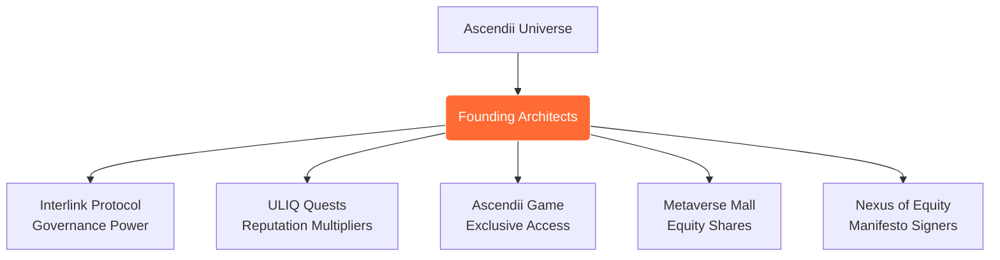

# Founding Architects  
**The Genesis NFT Collection & Reputation Primitives of the Ascendii Universe**
# 🏛️ The Founding Architects

> "Building the infrastructure for a persistent, sovereign, and equitable digital frontier."
> ---

## 💰 The Summons: Maestro of Economic Flow

**Ascendii is calling in a conductor to bring a completed economic architecture to life.**

The system is designed. The flows are mapped. The contributor‑equity mechanics are ready. The treasury logic is built. We do not need an architect—we need an **Orchestrator**.

### **The Calling**
We are seeking the individual who can activate, test, and sustain the living circulation of value through the Ascendii Universe. This is a role for someone who:

* **Thinks in Systems & Feels in Rhythms:** You understand that decentralization requires a steady pulse, not just a static code.
* **Masters the Tools:** You are fluent in Web3 treasury management and sustainability simulations.
* **Operationalizes Vision:** You can translate the complexity of our finished model into a clear, functional reality.
* **Stewards with Integrity:** You see economics as **orchestration, not extraction.**

### **Your Mandate**
You will not be building from scratch; you will be **conducting**. Your focus will be:
1.  **Activating the Treasury:** Bringing the financial heart of the Nexus online.
2.  **Implementing Equity:** Ensuring contributor rewards flow exactly as the architecture demands.
3.  **Monitoring & Refinement:** Using real-world feedback to keep the system in harmony as the world grows.

> *The First Circle is forming. If you hear the tempo of this world and can keep it in harmony, step forward.*

**[Contact the Founding Architects to Respond](INSERT_LINK_OR_EMAIL_HERE)**

---

## 🌌 Our Vision
The Founding Architects are the stewards of **The Ascendii Universe**. We believe that the digital future should not be owned by centralized silos, but by the creators and participants who inhabit it. 

Our mission is to bridge the gap between narrative lore and blockchain governance—transforming digital assets from mere entries on a ledger into **functional, persistent, and interoperable artifacts** that carry value across the entire ecosystem. We are not just building a platform; we are architecting a decentralized civilization.

## 📜 The Social Contract
Central to our mission is a commitment to transparency, anti-fragility, and collective equity. All development and governance within the Ascendii Universe are guided by our foundational principles.

* **[Read the Founding Architects Constitution](./Constitution.md)** — *Our core philosophy on digital sovereignty and decentralized law.*

---

## 🛠️ Core Pillars
* **Sovereign Identity:** Users retain total ownership of their data and assets.
* **The Nexus of Equity:** A governance model designed to reward contribution, not just capital.
* **Interoperability:** Building "The InterChange" to ensure assets are never trapped in a single chain or application.

---

## 🚀 Join the Architecture
We are currently in the **Foundational Phase**. If you are a developer, lore-builder, or visionary interested in shaping the Nexus:

1. Review the [Constitution](./Constitution.md).
2. Explore our [current issues](https://github.com/The-Ascendii-Universe/founding-architects/issues).
3. Connect with the Nexus of Equity DAO.

Founding Architects are soulbound (ERC-5484) + transferable sigil NFTs that represent **proof-of-contribution** for early builders, guardians, and visionaries in the Ascendii ecosystem. They unlock governance power in Interlink Protocol, ULIQ quests, game rewards, and metaverse mall equity.

**Mint your sigil. Build the future. ∞**

## Place in the Ascendii Universe

**Community**  
[Discord: Nexus of Equity](https://discord.gg/e9mWyUJX2) · [Mirror](https://mirror.xyz/ascendii.eth) · [@AscendiiUniverse](https://x.com/AscendiiUniverse)
